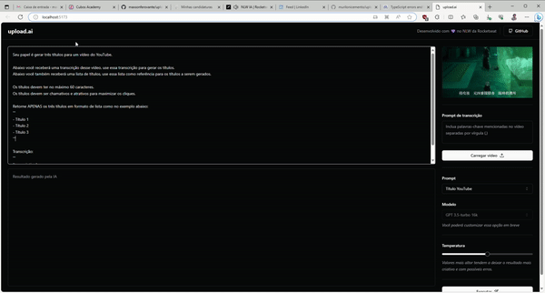

  

  
  

## 💻 Projeto

Aplicação que possibilita realizar upload de videos e por meio de IA, criar automaticamente títulos chamativos e descrições com um boa indexação.

## 📝 Licença

Esse projeto está sob a licença MIT. Veja o arquivo [LICENSE](LICENSE) para mais detalhes.

## Propósito do Projeto:

O objetivo deste projeto é criar uma aplicação poderosa de Inteligência Artificial que gera automaticamente títulos e descrições com base na transcrição de vídeos. Utilizamos a API da OpenAI para alimentar nossa IA e oferecer uma solução inovadora para simplificar a criação de conteúdo.

## Tecnologias Utilizadas:

React
Tailwind CSS
shadcn/ui
Radix UI
Prisma
Onde Js
API da OpenAI
TypeScript

Estas tecnologias de ponta foram escolhidas para garantir uma experiência de usuário fluida e uma base sólida para o desenvolvimento de recursos futuros.

## Deploy

Acesse a aplicação [aqui](https://upload-ai-zeta.vercel.app/)

  Feito por Maxson (NLY - Rocketseat Education).

<!--START_SECTION:footer-->

 
 

<!--END_SECTION:footer-->
